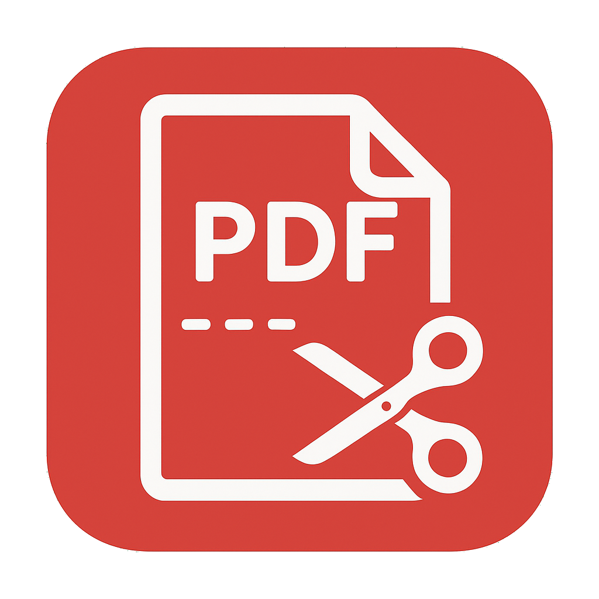

# PDF Splitter Pro

<div align="center">
  
  
  **A professional tool to split PDF documents with a modern UI.**
  
  [](https://www.python.org/)
  [](LICENSE)
  []()
</div>

---

## Features

- **Drag & Drop**: Simply drag your PDF file into the application.
- **Page Range Selection**: Choose start and end pages to extract.
- **Visual Feedback**: Clear status indicators (success, error).
- **Portable Executable**: No installation required.

---

## Quick Start (Pre-compiled Executable)

If you just want to use the application without setting up Python:

1. Download the executable directly: **[`PDF Splitter Pro.exe`](dist/PDF%20Splitter%20Pro.exe)** (located in the [`dist/`](dist/) folder).
2. Double-click to run.
3. Drag a PDF file or click to select one.
4. Enter the page range and click **SPLIT PDF**.
5. Choose where to save the output file.

> **Note**: The executable is a **fully portable** Windows application (~21 MB). You can copy it to a USB drive and run it on any Windows PC without installation or Python.

---

## Installation (From Source)

If you prefer to run from source or want to modify the code:

### Prerequisites
- Python 3.10 or higher
- pip (Python package manager)

### Steps

```bash
# Clone the repository
git clone https://github.com/yourusername/PDFsplitter.git
cd PDFsplitter

# Create a virtual environment (recommended)
python -m venv .venv
.venv\Scripts\activate

# Install dependencies
pip install -r requirements.txt

# Run the application
python -m src.main
```

---

## Usage Guide

1. **Load a PDF**: Drag & drop a PDF file into the drop zone, or click to open a file dialog.
2. **Set Page Range**: Enter the start and end page numbers.
3. **Split**: Click the **SPLIT PDF** button.
4. **Save**: Choose a destination for your new PDF.

### Keyboard Shortcuts
- `Ctrl+V`: Paste a file path from the clipboard.

---

## Build Your Own Executable

You can compile your own portable `.exe` using the included build script:

```bash
# Make sure you're in the virtual environment
.venv\Scripts\activate

# Run the build script
python build.py
```

The executable will be created in `dist/PDF Splitter Pro.exe`.

### Build Requirements
- PyInstaller (installed via `requirements.txt`)
- All dependencies from `requirements.txt`

---

## Technical Documentation

For developers who want to understand the codebase:

📄 **[PDF_Splitter_Pro_Technical.md](PDF_Splitter_Pro_Technical.md)**

This document includes:
- Architecture diagrams
- Module descriptions
- Data flow explanations
- Key design decisions

---

## Project Structure

```
PDFsplitter/
├── src/                    # Source code
│   ├── main.py             # Entry point
│   ├── interface.py        # GUI (Tkinter)
│   └── logic.py            # PDF splitting logic
├── assets/                 # Static resources
│   └── icon.png            # Application icon
├── dist/                   # Compiled executable
│   └── PDF Splitter Pro.exe
├── build.py                # Build automation
├── requirements.txt        # Python dependencies
├── README.md               # This file
└── PDF_Splitter_Pro_Technical.md  # Technical docs
```

---

## Dependencies

| Package | Purpose |
|---------|---------|
| PyPDF2 | PDF manipulation |
| Pillow | Image/icon handling |
| tkinterdnd2 | Drag & drop support |
| PyInstaller | Executable packaging |

---

## License

This project is open-source and available under the MIT License.

---

<div align="center">
  Made with ❤️ using Python and Tkinter
</div>
